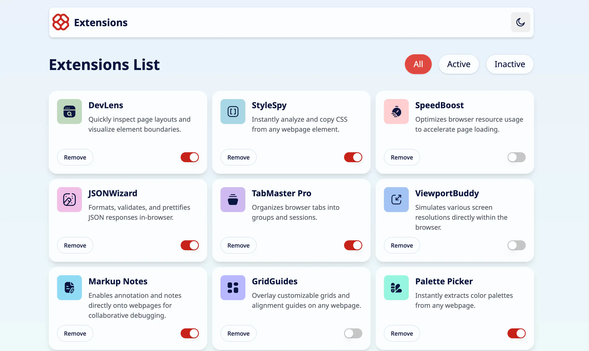
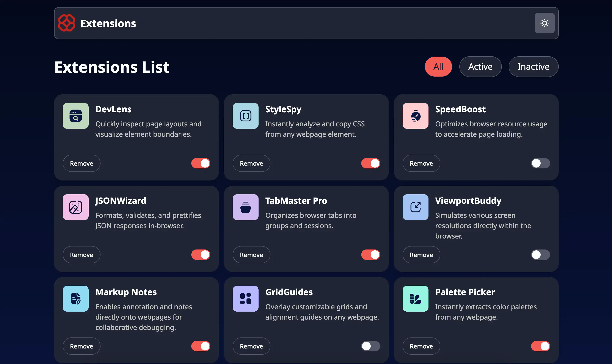

# Browser Extensions Manager UI

A modern Angular application for managing and showcasing browser extensions. This project provides a visually appealing interface to view, filter, activate/deactivate, and remove browser extensions, using mock data and reusable UI components.

---

## ScreenShots

<p align="center">
  
  
</p>

## Table of Contents

- [Browser Extensions Manager UI](#browser-extensions-manager-ui)
  - [ScreenShots](#screenshots)
  - [Table of Contents](#table-of-contents)
  - [Features](#features)
  - [Prerequisites](#prerequisites)
  - [Installation](#installation)
  - [Development server](#development-server)
  - [Usage](#usage)
  - [Project Structure](#project-structure)
  - [UI Components](#ui-components)
  - [Mock Extensions](#mock-extensions)
  - [Testing](#testing)
  - [Contributing](#contributing)
  - [License](#license)
  - [Contact](#contact)

---

## Features

- **Extension List**: View a list of browser extensions with logos, names, and descriptions.
- **Filtering**: Filter extensions by status (All, Active, Inactive).
- **Activation Toggle**: Enable or disable extensions with a switch.
- **Remove Extension**: Remove extensions from the list with confirmation.
- **Dark/Light Mode**: Toggle between dark and light themes.
- **Responsive UI**: Clean, responsive design using Tailwind CSS and custom styles.
- **Reusable Components**: Modular Angular components for easy extension and maintenance.

## Prerequisites

- [Node.js](https://nodejs.org/) (v18 or higher recommended)
- [pnpm](https://pnpm.io/) (or npm/yarn)

## Installation

Clone the repository and install dependencies:

```bash
pnpm install
# or
npm install
```

## Development server

To start a local development server, run:

```bash
ng serve
```

Once the server is running, open your browser and navigate to [http://localhost:4200/](http://localhost:4200/). The application will automatically reload whenever you modify any of the source files.

## Usage

- **Browse Extensions**: The main page displays a grid of available extensions (mock data).
- **Filter**: Use the filter buttons (All, Active, Inactive) to refine the list.
- **Toggle Activation**: Use the switch on each card to activate/deactivate an extension.
- **Remove**: Click the "Remove" button to delete an extension (with confirmation).
- **Dark Mode**: Use the sun/moon button in the header to toggle dark mode.

## Project Structure

```
├── src/
│   ├── app/
│   │   ├── card-item/           # Extension card component
│   │   ├── filters/             # Filter buttons component
│   │   ├── header/              # Header with dark mode toggle
│   │   ├── list-extension/      # Main extension list view
│   │   ├── extension.model.ts   # Extension data model
│   │   ├── extension.service.ts # Service for managing extensions
│   │   ├── mock-data.ts         # Mock extension data
│   │   └── ...
│   ├── assets/
│   │   └── fonts/               # (Reserved for custom fonts)
│   ├── index.html
│   ├── main.ts
│   └── styles.css               # Global styles (Tailwind, custom CSS)
├── public/
│   ├── images/                  # Extension logos and icons
│   └── favicon.ico
├── libs/ui/                     # Reusable UI components (button, switch)
│   ├── ui-button-helm/
│   └── ui-switch-helm/
└── ...
```

## UI Components

- **CardItem**: Displays extension info, activation switch, and remove button.
- **Filters**: Filter bar for All/Active/Inactive.
- **Header**: App title, logo, and dark mode toggle.
- **ListExtension**: Main grid of extension cards.
- **UI Button/Switch**: Custom button and switch components in `libs/ui/`.

## Mock Extensions

The app uses mock data for demonstration. Example extensions include:

- DevLens, StyleSpy, SpeedBoost, JSONWizard, TabMaster Pro, ViewportBuddy, Markup Notes, GridGuides, Palette Picker, LinkChecker, DOM Snapshot, ConsolePlus

## Testing

Unit tests are written with [Jest](https://jestjs.io/) and [Testing Library](https://testing-library.com/docs/angular-testing-library/intro/):

```bash
ng test
```

Test coverage includes services, components, and UI interactions (see `src/app/*.spec.ts`).

## Contributing

Contributions are welcome! Please fork the repository and submit a pull request. For major changes, open an issue first to discuss what you would like to change.

## License

This project is for educational/demo purposes. Add a LICENSE file if you intend to open source it.

## Contact

For questions or feedback, please open an issue or contact the maintainer.
